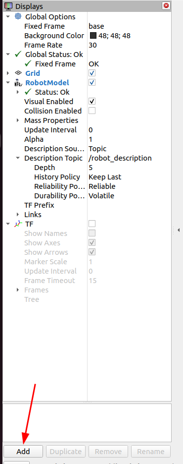
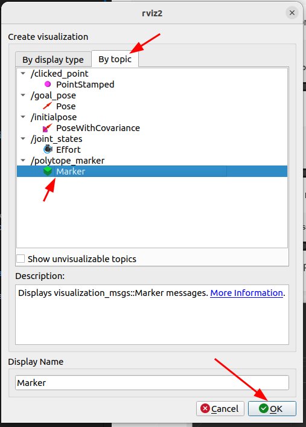
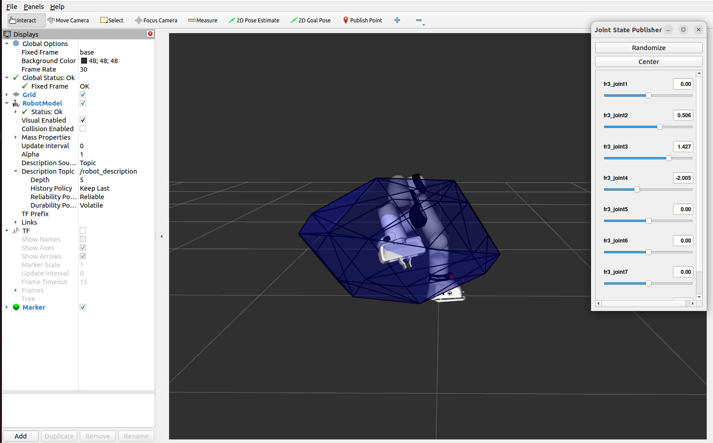

# Polytope visualization for Franka Emika Panda robot using PyCap and ROS2


This package provides a ROS2 node that computes and visualizes the velocity capacity polytope of the Franka Emika Panda robot using the `pycapacity` library. The polytope is published as visualization markers in RViz for easy inspection.

## How to use it

1. **Install Dependencies**: Ensure you have ROS2, `pycapacity`, `pinocchio`, and other required libraries installed in your Python environment.

```
pip install pycapacity pinocchio catkin_pkg # and other ros2 deps as needed
```

2. **Create a ROS2 Workspace**: If you don't have a ROS2 workspace, create one and clone this package into the `src` directory.

```
mkdir -p ~/franka_polytope_ws/src
cd ~/franka_polytope_ws/src
git clone <repository_url>
```

Clone the franka_description package for the URDF:

```
cd src
git clone git@github.com:frankarobotics/franka_description.git
```

3. **Build the Workspace**:

```
cd ~/franka_polytope_ws
colcon build --symlink-install && source install/setup.bash
```

4. **Run the Franka FR3 visualization node**:

```
ros2 launch franka_description visualize_franka.launch.py  robot_type:=fr3
```

You'll be able to see the Franka robot in RViz and interactively change its joint states using the provided GUI.


5. **Run the Polytope Visualization Node**:
```
ros2 run pycap_franka franka_capacity --ros-args -p frame_name:=fr3_link8
```

6. **Visualize in RViz**: Open RViz and add the "Marker" to see the velocity capacity polytope around the end-effector of the Franka robot.

Click on the "Add" button in RViz, select "By topic", and choose the `/polytope_marker_faces_fr3_link8` topic to visualize the polytope faces and `/polytope_marker_edges_fr3_link8` to visualize the edges.

   

You should be able to see the velocity capacity polytope visualized around the end-effector of the Franka robot in RViz. Now you can interactively change the joint states of the robot using the GUI, and observe how the polytope changes accordingly.


